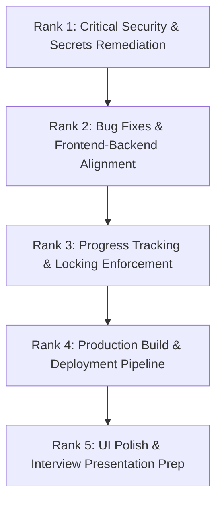

# CourseCraft Project Audit Report

This audit document provides a comprehensive analysis of the **CourseCraft (AI Academy)** codebase based on direct repository evidence.

---

## 1. Actual Technology Stack

### Frontend
- **Primary / Active**: React 19 SPA (`ai-academy/ai-academy-react/package.json#L15`), built with Vite (`ai-academy/ai-academy-react/package.json#L29`), React Router DOM v7 (`ai-academy/ai-academy-react/package.json#L17`), Axios & native Fetch API (`ai-academy/ai-academy-react/package.json#L13`).
- **Legacy / Secondary**: Vanilla HTML5, CSS3, JavaScript (`ai-academy/fontend/app.js`, note folder name typo `fontend`).
- **Browser APIs**: Web Speech API (`SpeechRecognition`) used in React frontend (`ai-academy/ai-academy-react/src/components/student/LessonContent.jsx#L18-L42`) for Feynman speech-to-text conversion.

### Backend
- **Framework**: Python 3.x / Django 5.2.7 (`ai-academy/requirements.txt#L10`, `ai-academy/manage.py#L9`).
- **API Engine**: Django REST Framework (DRF) 3.16.1 (`ai-academy/requirements.txt#L12`).
- **WSGI / Web Server**: Gunicorn 23.0.0 (`ai-academy/requirements.txt#L23`).
- **Static Assets**: WhiteNoise 6.11.0 (`ai-academy/backend/settings.py#L57`, `ai-academy/build.sh#L9`).

### Database
- **Production**: PostgreSQL configured via `dj-database-url` reading `DATABASE_URL` (`ai-academy/backend/settings.py#L93-L99`).
- **Local Development**: SQLite 3 (`ai-academy/backend/settings.py#L96`, `ai-academy/db.sqlite3`).

### Authentication & Authorization
- **Token Mechanism**: JSON Web Tokens (JWT) via `djangorestframework_simplejwt` 5.5.1 (`ai-academy/backend/settings.py#L155-L164`).
- **Custom Claims**: JWT payload embeds `username` and `role` (`ai-academy/core/serializers.py#L16-L22`).
- **User Roles**: Extended Django `User` model using `Profile` model with `ADMIN` and `STUDENT` roles (`ai-academy/core/models.py#L8-L18`).

### AI & Third-Party Services
- **Generative AI**: Google Gemini API via `google-generativeai` 0.8.5 (`ai-academy/requirements.txt#L19`, `ai-academy/core/views.py#L18`, using model `gemini-2.5-flash`).
- **Video Search**: YouTube Data API v3 via `google-api-python-client` 2.185.0 (`ai-academy/core/views.py#L169-L226`).

### Deployment Infrastructure
- **Backend**: Configured for Render deployment via `build.sh` script (`ai-academy/build.sh`) and `RENDER` environment variable check (`ai-academy/backend/settings.py#L26`).
- **Frontend**: Designed for Vercel / Netlify static hosting with dynamic CORS configuration (`ai-academy/backend/settings.py#L178`, `ai-academy/ai-academy-react/src/services/api.jsx#L2`).

---

## 2. API Endpoints & Access Control Matrix

| Endpoint | HTTP Methods | Permission Class | Target Role / Actual Access Control | File Reference |
|---|---|---|---|---|
| `/api/register/` | `POST` | `AllowAny` | Public / Unauthenticated. Registers user with `STUDENT` role by default. | [urls.py](file:///Users/kartikyasokhal/Documents/WORK/COLLEGE/SEM%203/CourseCraft/CourseCraft/ai-academy/core/urls.py#L28), [serializers.py](file:///Users/kartikyasokhal/Documents/WORK/COLLEGE/SEM%203/CourseCraft/CourseCraft/ai-academy/core/serializers.py#L36) |
| `/api/token/` | `POST` | `AllowAny` | Public / Unauthenticated. Returns JWT access & refresh tokens with embedded role claim. | [urls.py](file:///Users/kartikyasokhal/Documents/WORK/COLLEGE/SEM%203/CourseCraft/CourseCraft/ai-academy/core/urls.py#L29) |
| `/api/token/refresh/` | `POST` | `AllowAny` | Public / Unauthenticated. Refreshes expired access tokens. | [urls.py](file:///Users/kartikyasokhal/Documents/WORK/COLLEGE/SEM%203/CourseCraft/CourseCraft/ai-academy/core/urls.py#L30) |
| `/api/courses/generate/` | `POST` | `IsAuthenticated` | **Any Authenticated User** (🚨 Missing `IsAdminUser` permission on view level). | [urls.py](file:///Users/kartikyasokhal/Documents/WORK/COLLEGE/SEM%203/CourseCraft/CourseCraft/ai-academy/core/urls.py#L33), [views.py](file:///Users/kartikyasokhal/Documents/WORK/COLLEGE/SEM%203/CourseCraft/CourseCraft/ai-academy/core/views.py#L478-L480) |
| `/api/courses/` | `GET` | `IsAuthenticated` | `ADMIN` sees all courses; `STUDENT` sees `PUBLISHED` courses + courses created by self. | [urls.py](file:///Users/kartikyasokhal/Documents/WORK/COLLEGE/SEM%203/CourseCraft/CourseCraft/ai-academy/core/urls.py#L34), [views.py](file:///Users/kartikyasokhal/Documents/WORK/COLLEGE/SEM%203/CourseCraft/CourseCraft/ai-academy/core/views.py#L576-L582) |
| `/api/courses/<id>/` | `GET`, `PUT`, `PATCH`, `DELETE` | `IsAuthenticated` | GET: Admin or owner/published. PUT/PATCH/DELETE: **Any authenticated student can modify/delete courses** (🚨 Missing object-level role restriction). | [urls.py](file:///Users/kartikyasokhal/Documents/WORK/COLLEGE/SEM%203/CourseCraft/CourseCraft/ai-academy/core/urls.py#L35), [views.py](file:///Users/kartikyasokhal/Documents/WORK/COLLEGE/SEM%203/CourseCraft/CourseCraft/ai-academy/core/views.py#L584-L591) |
| `/api/courses/<pk>/generate-module/` | `POST` | `IsAuthenticated`, `IsAdminUser` | `ADMIN` role required. Generates single content or assessment module for a course. | [urls.py](file:///Users/kartikyasokhal/Documents/WORK/COLLEGE/SEM%203/CourseCraft/CourseCraft/ai-academy/core/urls.py#L38), [views.py](file:///Users/kartikyasokhal/Documents/WORK/COLLEGE/SEM%203/CourseCraft/CourseCraft/ai-academy/core/views.py#L536-L537) |
| `/api/modules/` | `POST` | `IsAuthenticated`, `IsAdminUser` | `ADMIN` role required. Creates a new module manually. | [urls.py](file:///Users/kartikyasokhal/Documents/WORK/COLLEGE/SEM%203/CourseCraft/CourseCraft/ai-academy/core/urls.py#L41), [views.py](file:///Users/kartikyasokhal/Documents/WORK/COLLEGE/SEM%203/CourseCraft/CourseCraft/ai-academy/core/views.py#L593-L594) |
| `/api/modules/<id>/` | `GET`, `PUT`, `PATCH`, `DELETE` | `IsAuthenticated` | GET: Enforces sequential module locking for students. PUT/PATCH/DELETE: **Any authenticated student can update/delete any module** (🚨 Missing `IsAdminUser` on view). | [urls.py](file:///Users/kartikyasokhal/Documents/WORK/COLLEGE/SEM%203/CourseCraft/CourseCraft/ai-academy/core/urls.py#L42), [views.py](file:///Users/kartikyasokhal/Documents/WORK/COLLEGE/SEM%203/CourseCraft/CourseCraft/ai-academy/core/views.py#L612-L628) |
| `/api/modules/<id>/submit-quiz/` | `POST` | `IsAuthenticated` | Authenticated `STUDENT`. Grades quiz answers and records module completion in `UserProgress`. | [urls.py](file:///Users/kartikyasokhal/Documents/WORK/COLLEGE/SEM%203/CourseCraft/CourseCraft/ai-academy/core/urls.py#L45), [views.py](file:///Users/kartikyasokhal/Documents/WORK/COLLEGE/SEM%203/CourseCraft/CourseCraft/ai-academy/core/views.py#L794-L829) |
| `/api/lessons/` | `POST` | `IsAuthenticated`, `IsAdminUser` | `ADMIN` role required. Creates lesson under a module. | [urls.py](file:///Users/kartikyasokhal/Documents/WORK/COLLEGE/SEM%203/CourseCraft/CourseCraft/ai-academy/core/urls.py#L48), [views.py](file:///Users/kartikyasokhal/Documents/WORK/COLLEGE/SEM%203/CourseCraft/CourseCraft/ai-academy/core/views.py#L630) |
| `/api/lessons/<id>/` | `GET`, `PUT`, `PATCH`, `DELETE` | `IsAuthenticated`, `IsAdminUser` | `ADMIN` role required. Reads/edits/deletes individual lessons. | [urls.py](file:///Users/kartikyasokhal/Documents/WORK/COLLEGE/SEM%203/CourseCraft/CourseCraft/ai-academy/core/urls.py#L49), [views.py](file:///Users/kartikyasokhal/Documents/WORK/COLLEGE/SEM%203/CourseCraft/CourseCraft/ai-academy/core/views.py#L632) |
| `/api/lessons/<id>/explain/` | `POST` | `IsAuthenticated` | Authenticated `STUDENT`. Evaluates text transcript for Feynman technique using Gemini; unlocks module if passed. | [urls.py](file:///Users/kartikyasokhal/Documents/WORK/COLLEGE/SEM%203/CourseCraft/CourseCraft/ai-academy/core/urls.py#L52), [views.py](file:///Users/kartikyasokhal/Documents/WORK/COLLEGE/SEM%203/CourseCraft/CourseCraft/ai-academy/core/views.py#L654-L789) |
| `/api/quizzes/` | `POST` | `IsAuthenticated`, `IsAdminUser` | `ADMIN` role required. Creates quiz for an assessment module. | [urls.py](file:///Users/kartikyasokhal/Documents/WORK/COLLEGE/SEM%203/CourseCraft/CourseCraft/ai-academy/core/urls.py#L55), [views.py](file:///Users/kartikyasokhal/Documents/WORK/COLLEGE/SEM%203/CourseCraft/CourseCraft/ai-academy/core/views.py#L634) |
| `/api/quizzes/<id>/` | `GET`, `PUT`, `PATCH`, `DELETE` | `IsAuthenticated`, `IsAdminUser` | `ADMIN` role required. Retrieves or manages a quiz. | [urls.py](file:///Users/kartikyasokhal/Documents/WORK/COLLEGE/SEM%203/CourseCraft/CourseCraft/ai-academy/core/urls.py#L56), [views.py](file:///Users/kartikyasokhal/Documents/WORK/COLLEGE/SEM%203/CourseCraft/CourseCraft/ai-academy/core/views.py#L636) |
| `/api/questions/` | `POST` | `IsAuthenticated`, `IsAdminUser` | `ADMIN` role required. Creates question for a quiz. | [urls.py](file:///Users/kartikyasokhal/Documents/WORK/COLLEGE/SEM%203/CourseCraft/CourseCraft/ai-academy/core/urls.py#L59), [views.py](file:///Users/kartikyasokhal/Documents/WORK/COLLEGE/SEM%203/CourseCraft/CourseCraft/ai-academy/core/views.py#L638) |
| `/api/questions/<id>/` | `GET`, `PUT`, `PATCH`, `DELETE` | `IsAuthenticated`, `IsAdminUser` | `ADMIN` role required. Retrieves or manages a specific question. | [urls.py](file:///Users/kartikyasokhal/Documents/WORK/COLLEGE/SEM%203/CourseCraft/CourseCraft/ai-academy/core/urls.py#L60), [views.py](file:///Users/kartikyasokhal/Documents/WORK/COLLEGE/SEM%203/CourseCraft/CourseCraft/ai-academy/core/views.py#L640) |
| `/api/reviews/` | `GET`, `POST` | `IsAuthenticated` | Authenticated Users. GET: filters by `course_id`. POST: submits rating (1-5) and comment for a course. | [urls.py](file:///Users/kartikyasokhal/Documents/WORK/COLLEGE/SEM%203/CourseCraft/CourseCraft/ai-academy/core/urls.py#L63), [views.py](file:///Users/kartikyasokhal/Documents/WORK/COLLEGE/SEM%203/CourseCraft/CourseCraft/ai-academy/core/views.py#L642-L647) |

---

## 3. Broken or Inconsistent Frontend-to-Backend Calls

1. **JWT Local Storage Key Mismatch in React Components (`access_token` vs `accessToken`)**
   - **Location**: [StudentQuizView.jsx:L27](file:///Users/kartikyasokhal/Documents/WORK/COLLEGE/SEM%203/CourseCraft/CourseCraft/ai-academy/ai-academy-react/src/components/student/StudentQuizView.jsx#L27) & [LessonContent.jsx:L90](file:///Users/kartikyasokhal/Documents/WORK/COLLEGE/SEM%203/CourseCraft/CourseCraft/ai-academy/ai-academy-react/src/components/student/LessonContent.jsx#L90)
   - **Evidence**: `StudentQuizView` and `LessonContent` retrieve the auth token using `localStorage.getItem('access_token')`. However, `AuthContext.jsx:L30`, `LoginPage.jsx:L36`, and `api.jsx:L6` store and read the JWT token under `accessToken`.
   - **Impact**: Submitting a quiz or submitting a Feynman audio/text explanation sends `Authorization: Bearer null` or triggers a `401 Unauthorized` error.

2. **Hardcoded Localhost API Base URLs in React Components**
   - **Location**: [StudentQuizView.jsx:L29](file:///Users/kartikyasokhal/Documents/WORK/COLLEGE/SEM%203/CourseCraft/CourseCraft/ai-academy/ai-academy-react/src/components/student/StudentQuizView.jsx#L29) & [LessonContent.jsx:L100](file:///Users/kartikyasokhal/Documents/WORK/COLLEGE/SEM%203/CourseCraft/CourseCraft/ai-academy/ai-academy-react/src/components/student/LessonContent.jsx#L100)
   - **Evidence**: Both components call `http://127.0.0.1:8000/api/...` directly via `fetch()` instead of using the central `API_BASE_URL` defined in [api.jsx:L2](file:///Users/kartikyasokhal/Documents/WORK/COLLEGE/SEM%203/CourseCraft/CourseCraft/ai-academy/ai-academy-react/src/services/api.jsx#L2).
   - **Impact**: In deployed production environments (e.g. Render/Vercel), requests bypass environment configuration (`VITE_API_URL`) and fail completely due to pointing to `127.0.0.1`.

3. **Legacy Vanilla Frontend (`fontend/app.js`) MCQ Model Schema Mismatch**
   - **Location**: [app.js:L334-L380](file:///Users/kartikyasokhal/Documents/WORK/COLLEGE/SEM%203/CourseCraft/CourseCraft/ai-academy/fontend/app.js#L334-L380)
   - **Evidence**: `app.js` attempts to access `lesson.mcq_question`, `lesson.mcq_options`, and `lesson.mcq_correct_answer`. In the backend, `Lesson` models ([models.py:L54-L65](file:///Users/kartikyasokhal/Documents/WORK/COLLEGE/SEM%203/CourseCraft/CourseCraft/ai-academy/core/models.py#L54-L65)) do not have MCQ fields; quizzes are stored separately in `Quiz` and `Question` models under assessment modules.
   - **Impact**: Legacy vanilla frontend quiz UI is completely non-functional.

4. **Legacy Vanilla Frontend (`fontend/app.js`) Payload Key Mismatch**
   - **Location**: [app.js:L167](file:///Users/kartikyasokhal/Documents/WORK/COLLEGE/SEM%203/CourseCraft/CourseCraft/ai-academy/fontend/app.js#L167)
   - **Evidence**: `app.js` sends `{ prompt, num_modules }` to `POST /api/courses/generate/`. The backend endpoint ([views.py:L484-L487](file:///Users/kartikyasokhal/Documents/WORK/COLLEGE/SEM%203/CourseCraft/CourseCraft/ai-academy/core/views.py#L484-L487)) expects `num_content_modules`, `num_lessons_per_module`, and `num_test_modules`.
   - **Impact**: `num_modules` is ignored by the backend, falling back to default parameter values (3 content modules).

5. **Legacy Vanilla Frontend (`fontend/app.js`) Missing Endpoints**
   - **Location**: [app.js](file:///Users/kartikyasokhal/Documents/WORK/COLLEGE/SEM%203/CourseCraft/CourseCraft/ai-academy/fontend/app.js)
   - **Evidence**: `app.js` lacks any code referencing `POST /api/modules/<id>/submit-quiz/` or `POST /api/lessons/<id>/explain/`.
   - **Impact**: Module locking, quiz grading, and Feynman technique features are entirely absent from the HTML/JS frontend.

---

## 4. Security Audit & Vulnerabilities

1. **Quiz Answer Exposure in JSON API Payload (High Severity)**
   - **Location**: [serializers.py:L73-L76](file:///Users/kartikyasokhal/Documents/WORK/COLLEGE/SEM%203/CourseCraft/CourseCraft/ai-academy/core/serializers.py#L73-L76) & [serializers.py:L78-L83](file:///Users/kartikyasokhal/Documents/WORK/COLLEGE/SEM%203/CourseCraft/CourseCraft/ai-academy/core/serializers.py#L78-L83)
   - **Evidence**: `QuestionSerializer` includes `correct_answer` in its fields list:
     ```python
     class QuestionSerializer(serializers.ModelSerializer):
         class Meta:
             model = Question
             fields = ['id', 'question_text', 'options', 'correct_answer', 'order']
     ```
     `QuestionSerializer` is nested inside `QuizSerializer` -> `ModuleSerializer` -> `CourseDetailSerializer`.
   - **Impact**: Whenever any student fetches course details (`GET /api/courses/<id>/`), the backend returns every quiz question along with its plaintext `correct_answer`. Students can inspect the network response to get 100% on all quizzes.

2. **Hardcoded API Keys & Secrets Committed to Git (Critical Severity)**
   - **Location**: [.env:L1-L2](file:///Users/kartikyasokhal/Documents/WORK/COLLEGE/SEM%203/CourseCraft/CourseCraft/ai-academy/.env#L1-L2) & [settings.py:L22](file:///Users/kartikyasokhal/Documents/WORK/COLLEGE/SEM%203/CourseCraft/CourseCraft/ai-academy/backend/settings.py#L22)
   - **Evidence**: Production Google Gemini API Key (`GEMINI_API_KEY=AIzaSyAWtys...`) and YouTube Data API Key (`YOUTUBE_API_KEY=AIzaSyC54j...`) are committed in `ai-academy/.env`. Furthermore, `settings.py` provides a hardcoded fallback string for Django `SECRET_KEY`.
   - **Impact**: Secret key leakage, risk of API quota exhaustion, and financial/billing abuse.

3. **Missing Authorization / Excessive Permissions on Endpoints (High Severity)**
   - **Location**: [views.py:L478-L480](file:///Users/kartikyasokhal/Documents/WORK/COLLEGE/SEM%203/CourseCraft/CourseCraft/ai-academy/core/views.py#L478-L480) & [views.py:L612-L615](file:///Users/kartikyasokhal/Documents/WORK/COLLEGE/SEM%203/CourseCraft/CourseCraft/ai-academy/core/views.py#L612-L615)
   - **Evidence**:
     - `CourseGenerateAPIView` uses `permission_classes = [permissions.IsAuthenticated]`. Any logged-in `STUDENT` can invoke AI course generation, initiating multiple Gemini and YouTube API calls.
     - `ModuleDetailAPIView` uses `permission_classes = [permissions.IsAuthenticated]`. While `retrieve` checks module locking, write operations (`PUT`, `PATCH`, `DELETE`) have no role checks, allowing any student to modify or delete any course module.

4. **Insecure CORS Configuration (Medium Severity)**
   - **Location**: [settings.py:L171-L175](file:///Users/kartikyasokhal/Documents/WORK/COLLEGE/SEM%203/CourseCraft/CourseCraft/ai-academy/backend/settings.py#L171-L175)
   - **Evidence**: `CORS_ALLOWED_ORIGINS` explicitly includes `"null"`.
   - **Impact**: Requests originating from sandboxed iframes or local HTML files (`file://`) are allowed to send cross-origin requests with credentials.

5. **Unsafe HTML Rendering / Potential XSS (Medium Severity)**
   - **Location**: [LessonContent.jsx:L212](file:///Users/kartikyasokhal/Documents/WORK/COLLEGE/SEM%203/CourseCraft/CourseCraft/ai-academy/ai-academy-react/src/components/student/LessonContent.jsx#L212) & [app.js:L331](file:///Users/kartikyasokhal/Documents/WORK/COLLEGE/SEM%203/CourseCraft/CourseCraft/ai-academy/fontend/app.js#L331)
   - **Evidence**: `LessonContent.jsx` renders HTML content from Gemini using `dangerouslySetInnerHTML={createMarkup(lesson.content)}` without sanitization.
   - **Impact**: If AI outputs unsanitized HTML containing executable scripts or malicious tags, it introduces Cross-Site Scripting (XSS) risks.

---

## 5. Ranked Implementation Roadmap for Interview-Ready Deployment



### Rank 1: Critical Security & Secrets Remediation
- **Secret Management**: Rotate compromised API keys. Remove `ai-academy/.env` from git tracking and ensure `.env` is listed in `.gitignore`. Use environment variables exclusively.
- **Hide Quiz Answers**: Create a `StudentQuestionSerializer` (omitting `correct_answer`) used during course navigation, and reserve `QuestionSerializer` (with `correct_answer`) strictly for administrative views.
- **Fix Authorization**:
  - Restrict `CourseGenerateAPIView` to `IsAdminUser`.
  - Update `ModuleDetailAPIView` permission classes to `[IsAdminOrReadOnly]`.
- **CORS Cleanup**: Remove `"null"` from `CORS_ALLOWED_ORIGINS` in `settings.py`.
- **XSS Protection**: Integrate `DOMPurify` to sanitize HTML content in `LessonContent.jsx` before invoking `dangerouslySetInnerHTML`.

### Rank 2: Bug Fixes & Frontend-Backend Alignment
- **Token Key Standardization**: Update `StudentQuizView.jsx` and `LessonContent.jsx` to read `localStorage.getItem('accessToken')`.
- **Centralize API Base URL**: Update `StudentQuizView.jsx` and `LessonContent.jsx` to import and use `API_BASE_URL` from `services/api.jsx`.
- **Frontend Consolidation**: Deprecate/archive the legacy `fontend` directory and focus exclusively on the React single-page app in `ai-academy-react`.

### Rank 3: Progress Tracking & Locking Enforcement
- **Frontend Locking Verification**: Ensure `CourseSidebar.jsx` and `CourseViewer.jsx` inspect `is_locked` and `is_completed` flags from `ModuleSerializer`.
- **Progress State Synchronization**: Ensure that successful completion of a quiz (`POST /api/modules/<id>/submit-quiz/`) or Feynman challenge (`POST /api/lessons/<id>/explain/`) triggers an immediate course re-fetch to unlock the next module.

### Rank 4: Production Build & Deployment Pipeline
- **Backend Deployment (Render)**: Set environment variables (`SECRET_KEY`, `GEMINI_API_KEY`, `YOUTUBE_API_KEY`, `DATABASE_URL`, `CORS_ALLOWED_ORIGINS`, `RENDER=true`). Verify `build.sh` runs migrations and static file collection via WhiteNoise cleanly.
- **Frontend Deployment (Vercel)**: Set `VITE_API_URL` to point to the live Render backend API. Add a `vercel.json` rewrite rule to support React Router client-side routing.

### Rank 5: UI Polish & Interview Presentation Prep
- **Codebase Cleanliness**: Fix folder structure naming inconsistencies.
- **User Experience**: Add loading skeletons, Toast notification alerts for AI rate limits (`429 Too Many Requests`), and verify end-to-end user flows for both Admin and Student roles.
